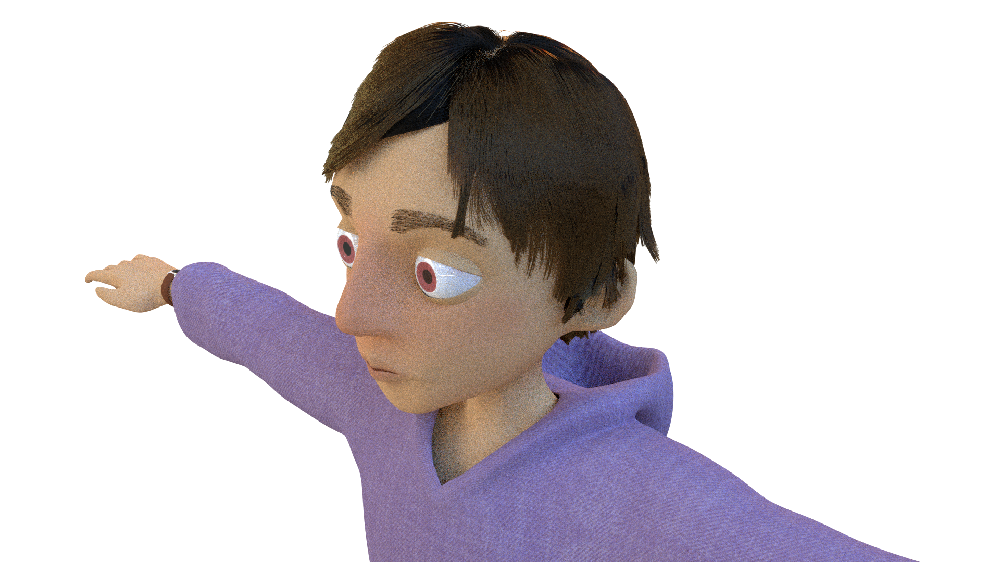
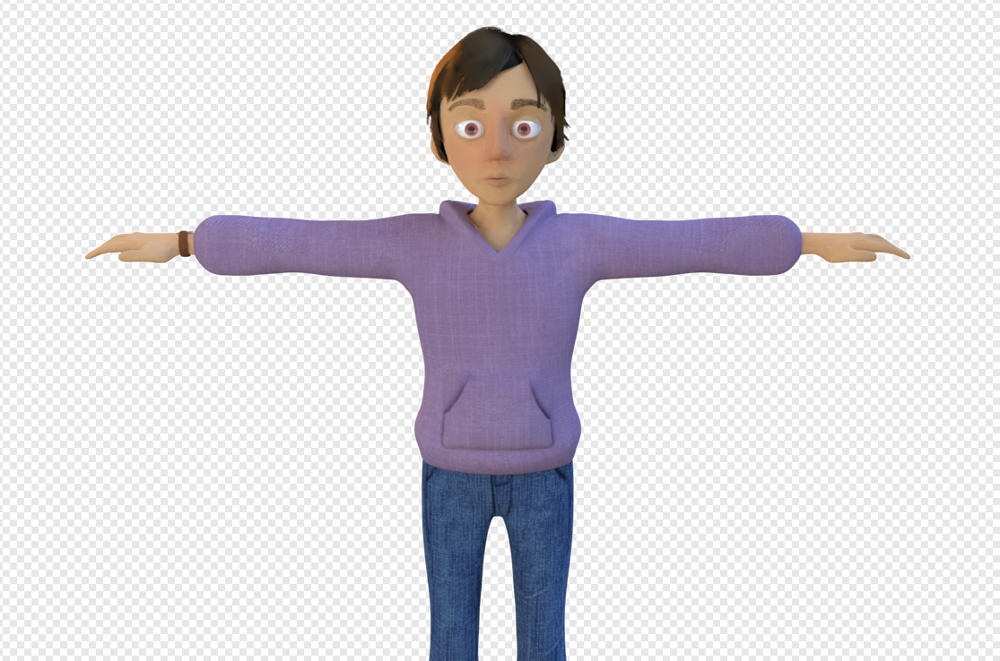

A human character model and rig for the short "Time Less."
  

## Overview
In Fall 2018, I worked on the UCBUGG advanced short "Time Less", with most of my time focused on bringing the main character, nicknamed Billy, to 3D. It was my first time working on a human character model, so it was a huge learning experience and I learned a lot from the experience. I modeled, shaded and rigged the character in Maya and created his hair groom with XGen Interactive Groom. The character design was done by Connie Chen. I spent about a month working on this character, and the full short can be found on the [UCBUGG YouTube page](https://www.youtube.com/watch?v=JkhhP1J3Sok).

