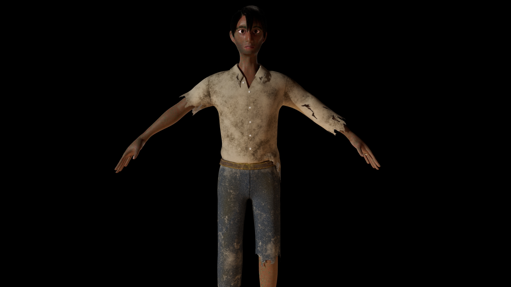

Mirage is a 3D animated short I've been directing under the year-long course CNM 190 at UC Berkeley.
  

I'm working with a team of 10 other students to make a short film, producing all of the assets for all parts of the pipeline from scratch. I've worked on pre-production, character modeling for the hero character, Jon, XGen grooming for that character and various other aspects of the short. We plan to finish the film by the end of April. Below is a work-in-progress render of our hero character.

Additional credits for this render:
* Character concept art: Celine Tang
* Skin shading: Ethan Buttimer
* Additional shading: Celine Tang and Anny Wu

This page is still under construction. You can check out my blog for some of the work I've done on Mirage.
