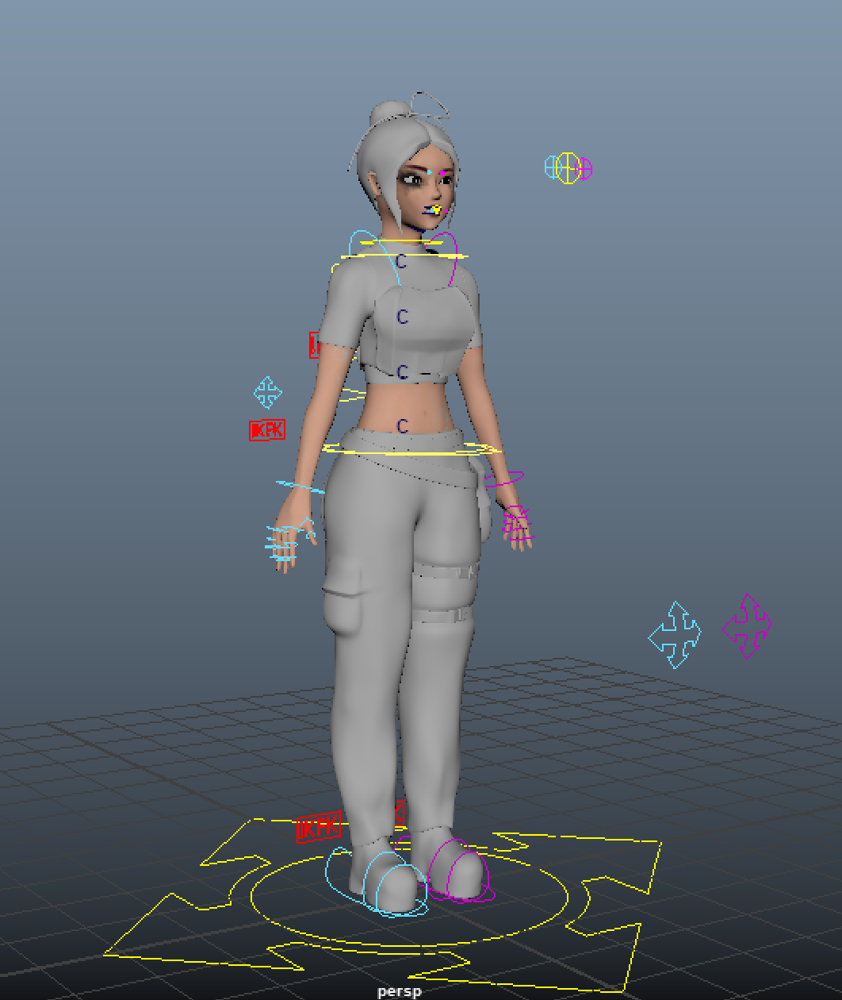

I worked on preproduction and rigging for this 3D animated short.
  

## Overview
I built the main character rig together with Soohyun Cho. It was our first time building a more complex rig, with IK/FK switching and a facial rig. I focused primarily on the facial rig, giving it features such as highly controllable, joint-driven eyelid controls. I also helped set up the IK/FK switch system and the overall rig design.

We also designed the rig to be transferrable between two different versions of the character.

