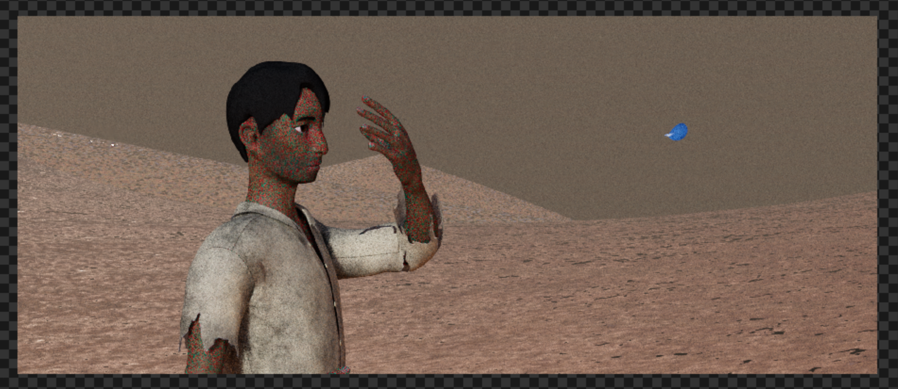
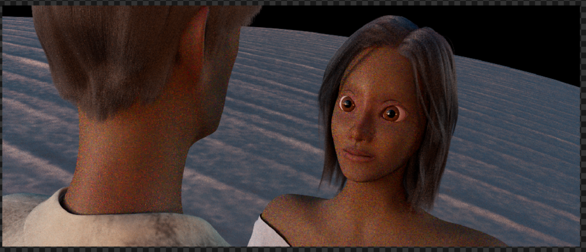
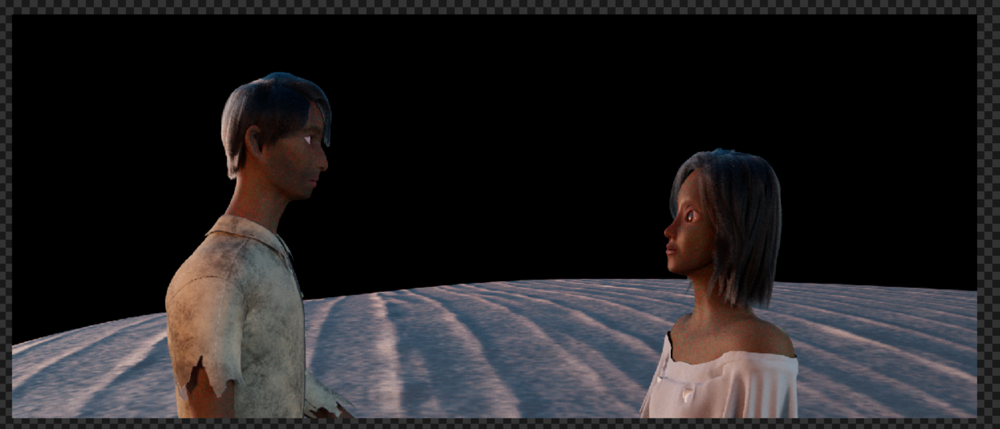
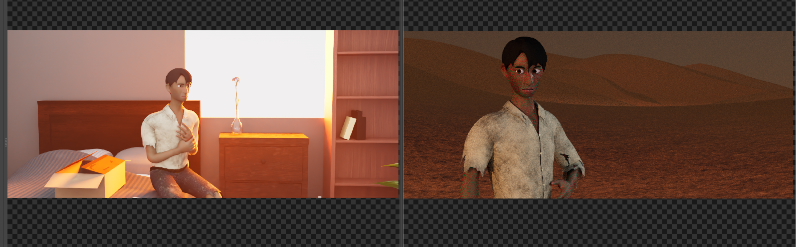
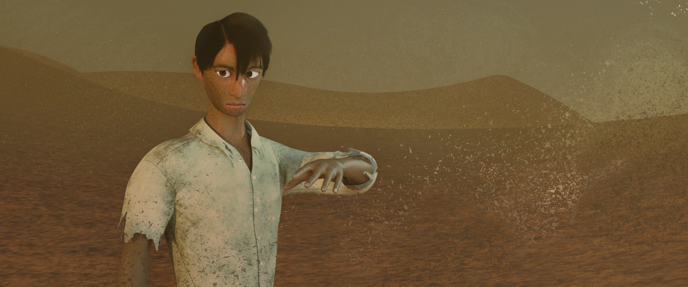
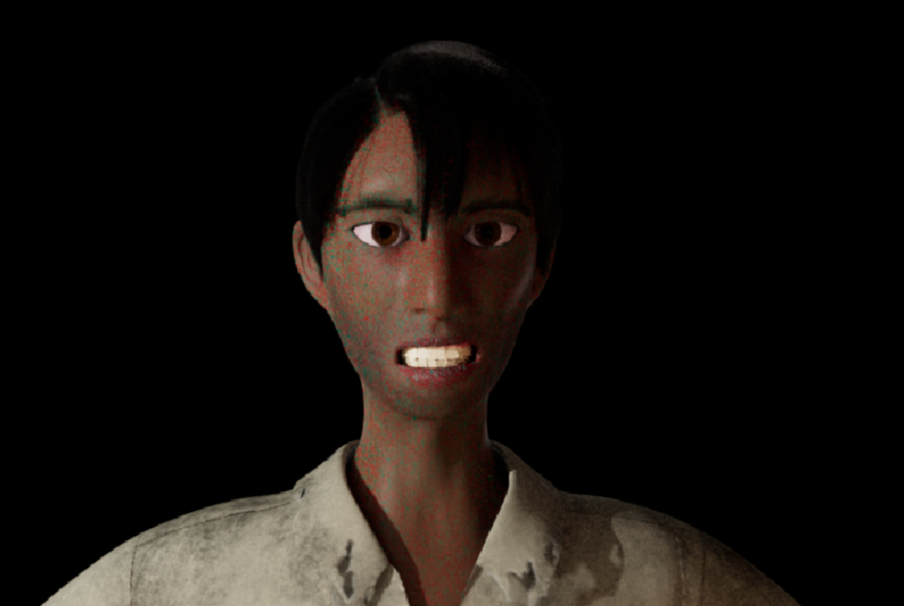
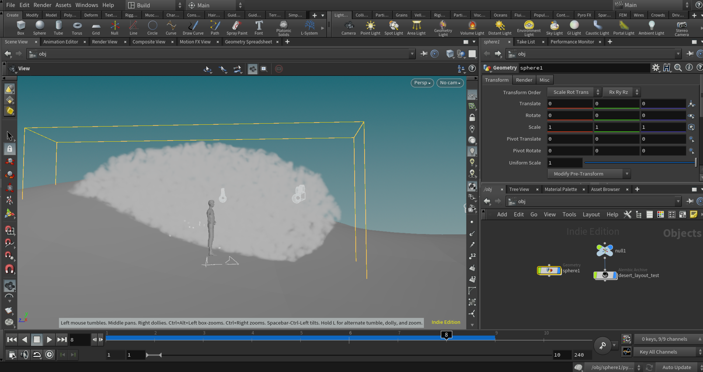
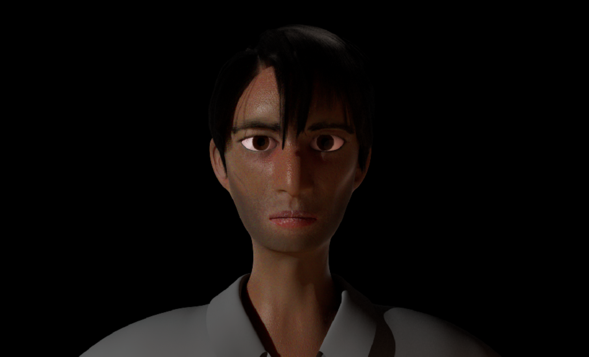
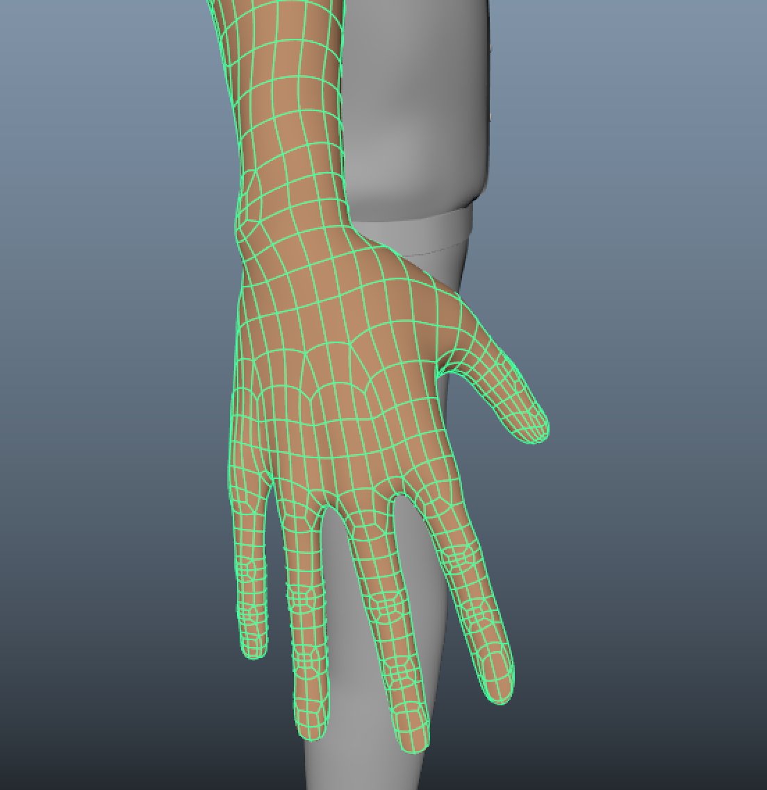
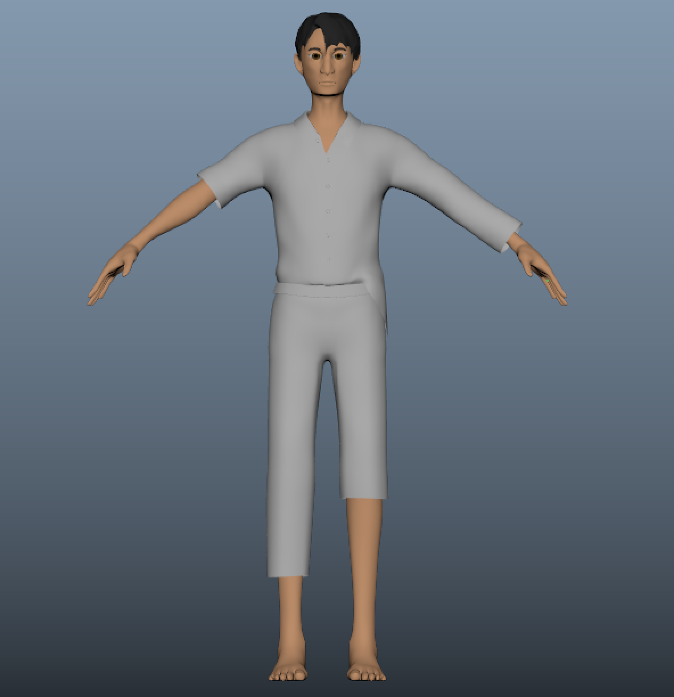

2021 ------------------------------------
* [Week of 4/10-4/16](#4/10-4/16)
* [Week of 4/3-4/9](#4/3-4/9)
* [Week of 3/27-4/2](#3/27-4/2)
* [Week of 3/13-3/19](#3/13-3/19)
* [Week of 2/27-3/5](#2/27-3/5)
* [Week of 2/20-2/26](#2/20-2/26)
* [Week of 2/13-2/19](#2/13-2/19)
* [Week of 2/6-2/12](#2/6-2/12)
* [Week of 1/30-2/5](#1/30-2/5)
* [Week of 1/23-1/29](#1/23-1/29)

2020 ------------------------------------
* [Week of 12/5-12/11](#12/5-12/11)
* [Week of 11/28-12/4](#11/28-12/4)
* [Week of 11/14-11/20](#11/14-11/20)
* [Week of 11/7-11/13](#11/7-11/13)
* [Week of 10/31-11/6](#10/31-11/6)
* [Week of 10/24-10/30](#10/24-10/30)
* [Week of 10/17-10/23](#10/17-10/23)
* [Week of 10/10-10/16](#10/10-10/16)
* [Week of 10/3-10/9](#10/3-10/9)
* [Week of 9/26-10/2](#9/26-10/2)

<h3 id="4/10-4/16" class="anchor">4/10-4/16</h3>

This week, I worked on refining the hair simulation, specifically looking into workflows to speed up the process of moving simulated hair between Maya files, since some of my cache files were larger than 1 GB last week. I don't have a ton of visual updates to show on this front, since it's mostly just messing around with caching setups and whatnot. I also spent some time to make some preview (non-simmed) hair grooms visible on Lila and Jon's rig files so that lighting artists can see how the hair looks as they work.

<h3 id="4/3-4/9" class="anchor">4/3-4/9</h3>

This week, I continued my work on hair simulation, working to put together hair sims for both characters in a Maya scene. I ran into a lot of issues with running out of memory on my computer and such while working on this process, so I'm looking into more lightweight ways to work with the XGen hair grooms between Maya and Houdini. I also did a bit of rig tweaking to provide a bit more control and continued to provide feedback to my team on lighting and animation.

<h3 id="3/27-4/2" class="anchor">3/27-4/2</h3>

Over break, I worked mostly on hair simulation work in Houdini and some preliminary lighting workflow tests. I worked a lot with Alembic caches, which was really informative and helped me get experienced with bringing scenes together via cache. After some experimenting, I used a Linear Wire modifier on Lila's XGen groom in order to get guide curves which could be exported to Houdini. From there, I used Houdini's Vellum solver to drive a simulation on these curves, which I then brought back into Maya and IGS.

<h3 id="3/13-3/19" class="anchor">3/13-3/19</h3>

This week, I started taking a closer look at lighting so that the others working on lighting will have a nice starting point based on my tests. Based on those tests, I was able to find a combination of PxrVolume lights and environment lights that gave us a good amount of control to get colors to match our color scripts. I also resumed my test renders from last week, bringing in caches for render testing.

<h3 id="3/6-3/12" class="anchor">3/6-3/12</h3>

While it was a bit of a busy week for me, I was still able to make some progress with my tasks. I've been testing out workflows for bringing cached objects into scenes, which will be particularly important for the XGen hair and, eventually, the cloth simulations. I've also spent quite a while debugging various pipeline / reference issues that have popped up, such as Jon's eyelids getting Truly warped for some reason and the blendshapes spent the better part of the past week slowly breaking. All appears to be fine now, though. Here's a test render I did. Some shaders weren't quite set up correctly, so please forgive the fact that they appear to be on the moon.

<h3 id="2/27-3/5" class="anchor">2/27-3/5</h3>

I continued working on various pipeline things this past week, doing test renders and making sure that we could bring various assets together into our scenes. Lila's rig file is also missing key features such as her eyes due to some reference weirdness, and Jon's pants have some issues due to rig adjustments that I did last week, so I've been modifying those files as issues have popped up. As director, I continued to give shot-by-shot feedback to the animators on their progress. Since some of our prop shaders never got a full second pass last semester, I've been taking notes on which shaders need to be touched up and also tested some adjustments during the process of making test renders. For instance, in the right of the below image, I made some adjustments to the distant desert dunes so that they fill the background in a more desert-like fashion.

<h3 id="2/20-2/26" class="anchor">2/20-2/26</h3>

There's been some slowdowns in our quest for a vertical slice render, but I spent this work working on getting our desert set rendered with Jon in it so we can better visualize how those assets are coming together. Below is a quick render I made with some quickly composited sand on top. I also explored nParticle simulation for some additional dust/sand particles to add to the desert renders. As director, I advised people on shot direction and animation throughout the week as the animations got more refined. After some review of initial animation with Jon's rig, I continued to touch up the skinning and made some modifications to the rig for better head rotations.

<h3 id="2/13-2/19" class="anchor">2/13-2/19</h3>

This week, I further refined Jon's skinning. I also worked on fixing up Jon's teeth model, since we were using a really rough placeholder for earlier stages of the pipeline. I've been doing some test renders getting everything together, with Jon in the desert set with some placeholder lighting just to see how things are coming together, with our goal being to get a "vertical slice" type of frame out soon.

<h3 id="2/6-2/12" class="anchor">2/6-2/12</h3>

I worked on Jon's skinning, using some of the concepts we learned from Jacob Lilly to make sure the deformation looked good. It's been a while since I've skinned a character, so it took a bit of getting used to, but it ended up being a pretty straightforward process once I got the workflow down.

<iframe src="https://drive.google.com/file/d/1fn85KafH9E4JiA8qDef0myxuhHG2IFEi/preview"></iframe>

I also spent some time refining his rig controls, adding a rig control to swap between his sculpted, proxy hair and a referenced XGen groom.

<h3 id="1/30-2/5" class="anchor">1/30-2/5</h3>

I started off the week by further refining Jon's XGen hair from last week. I also helped debug some shaders with Celine and Anny, so that we were finally able to produce some complete renders with Jon, his hair, and his clothing. Seeing these renders made me super excited to see our characters and our short coming together.

Towards the end of the week, I shifted to working on testing out Maya to Houdini workflows, since we still intend on using Houdini and Maya simulations.

<h3 id="1/23-1/29" class="anchor">1/23-1/29</h3>
This past week, I mostly focused on finishing a first pass for Jon's hair in XGen. While I've made a few grooms in the past, I used Ali's video to do a pure Interactive Groom workflow instead of a XGen / Interactive Groom hybrid. I also added eyebrows and eyelashes to Jon's skin and tested blendshapes for a few expressions that we wanted Jon to hit.

<h3 id="12/5-12/11" class="anchor">12/5-12/11</h3>

Earlier in the week, I worked on finalizing Jon's body topology, giving his hands another pass after looking at more topology references online. I also modeled teeth for his mesh, re-organized his file's outliner to make it easier to navigate, optimized the scene size and prepared the file for shading. Celine and I worked together to finalize his eye meshes based off of Ali's presentation from the other day to make sure it was shading-ready. His UVs from last week somehow got saved over, so I did a couple more passes on his UV map. Honestly, Jon's felt 99% close to completion for a couple weeks, but it felt nice to Really finalize everything in time for shading and rigging to begin in earnest.

<h3 id="11/28-12/4" class="anchor">11/28-12/4</h3>

I worked on refining Jon's topology, focusing a lot on his clothes. I also started some basic shading tests for Jon, without any texture maps.

I also worked on procedurally generating background dunes with a RenderMan procedural shader.

<h3 id="11/14-11/20" class="anchor">11/14-11/20</h3>
This week, I worked with Connie to help refine the sculpt of the desert, locking some preliminary cameras and doing drawovers on Zoom to help refine how we want the desert to look in each shot.

Admittedly, my progress on Jon this week has slowed somewhat, as my laptop had to be sent in for repairs and I had to spend some time migrating to a new computer. I worked on resizing Jon to real world scale, so that exporting him to Maya results in correctly sized units, and further refined the topology for his clothes. After checking in with Cameron tomorrow, I hope to finish up his clothing and body retopology before class on Monday.

<h3 id="11/7-11/13" class="anchor">11/7-11/13</h3>

This week, we continued to refine our story details, and I continued my role as director in overseeing and signing off on changes to beats. I also continued to iterate on the character model, using feedback from my group and class crit. I also started working on more finalized, simulation-ready topology for the man's clothing, using Christine's advice and starting the clothes as a one-sided, symmetrical mesh in Maya.

<h3 id="10/31-11/6" class="anchor">10/31-11/6</h3>

With our story moving forward in a direction that we're confident with, I was able to take a bit of a step back from actively working on revising the boards and animatic and focusing on the look of our character models. I refined the character sculpt based on discussions with the and Christine's critique on Monday, and also began the process of defining the character's low poly topology. I have yet to make the final clothing in Maya or completely fix up the topology in Maya.

<h3 id="10/24-10/30" class="anchor">10/24-10/30</h3>

This week, I worked on a few animatic changes before moving over to character modeling in ZBrush. I worked on the character sculpt for the man, based off Celine's turnaround for him. Some screenshots are attached below.

<h3 id="10/17-10/23" class="anchor">10/17-10/23</h3>

This week, I continued working on refining the story and design of the characters with the rest of the team. I also made sure that these changes were consistent across the short, tell the story we want, and reflect the backstory decisions we made last weekend. Revisions to boards were started based on what we discussed. An example of something I boarded can be seen below.

I gave edits and guidance as people worked on other parts of the pipeline, from character design feedback to modeling notes.

I've also been looking forward to later parts of the pipeline to see what kinds of decisions we'll need to make as a team. For example, after Friday's lecture, I spent a couple hours testing the ACES shading and rendering workflow in RenderMan for Maya based off a random scene that I made.

<h3 id="10/10-10/16" class="anchor">10/10-10/16</h3>

I worked on storyboard revisions for the first half of the week. This time, the animatic team jamboarded storyboard ideas together to figure out how to best express the story we are trying to tell.

To make it easier for people to track changes in the story and solidify our short's overall direction, I also created a slide-deck to break down story beats and the Pillars of the short.

I also did some sketches of character designs and stuff.

<h3 id="10/3-10/9" class="anchor">10/3-10/9</h3>

For this week, I worked on adjusting our storyboards based on guest feedback and gave feedback on people's character designs. A few of these storyboards can be seen below.

I also contributed to environment design, trying to define the shape language of the desert and testing out how we can use simple gradients of color to establish the atmosphere.

<h3 id="9/26-10/2" class="anchor">9/26-10/2</h3>

For this week, I worked on developing our short's style and iterating upon concept art. Over the first few days, I contributed to research and made some early character design mockups.

Based on Monday's guest lecture from Megan Gritzfeld, I wrote up a 4-page [design guideline document](https://docs.google.com/document/d/1Jj6H4vwXn4xipc35a3Upq_s_Fv-56Yrdx3385WwjRiY/) for our short that would directly complement our short's main concepts.

I worked on a number of character design sketches, working on figuring out where to balance the more fantastical look of the desert and the visual language of desert clothing with the background of our character.

I also made a number of boards, some of which have yet to make it into the animatics that we've shown in class.

