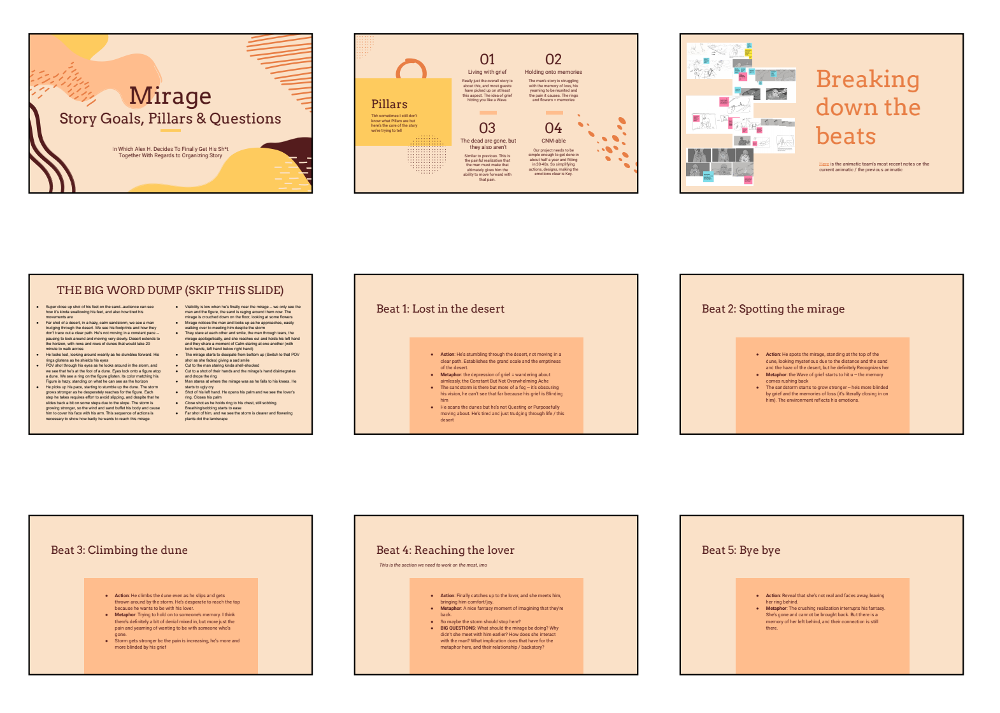

* [Week of 9/26-10/2](#9/26-10/2)
* [Week of 10/3-10/9](#10/3-10/9)
* [Week of 10/10-10/16](#10/10-10/16)

<h3 id="9/26-10/2" class="anchor">9/26-10/2</h3>

For this week, I worked on developing our short's style and iterating upon concept art. Over the first few days, I contributed to research and made some early character design mockups.

Based on Monday's guest lecture from Megan Gritzfeld, I wrote up a 4-page [design guideline document](https://docs.google.com/document/d/1Jj6H4vwXn4xipc35a3Upq_s_Fv-56Yrdx3385WwjRiY/) for our short that would directly complement our short's main concepts.

I worked on a number of character design sketches, working on figuring out where to balance the more fantastical look of the desert and the visual language of desert clothing with the background of our character.

I also made a number of boards, some of which have yet to make it into the animatics that we've shown in class.

<h3 id="10/3-10/9" class="anchor">10/3-10/9</h3>

For this week, I worked on adjusting our storyboards based on guest feedback and gave feedback on people's character designs. A few of these storyboards can be seen below.

I also contributed to environment design, trying to define the shape language of the desert and testing out how we can use simple gradients of color to establish the atmosphere.

<h3 id="10/10-10/16" class="anchor">10/10-10/16</h3>

I worked on storyboard revisions for the first half of the week. This time, the animatic team jamboarded storyboard ideas together to figure out how to best express the story we are trying to tell.

To make it easier for people to track changes in the story and solidify our short's overall direction, I also created a slide-deck to break down story beats and the Pillars of the short.

I also did some sketches of character designs and stuff.

